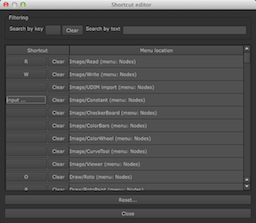

# Nuke shortcut editor

`shortcuteditor` is a keyboard shortcut editor for
[The Foundry's Nuke](http://www.thefoundry.co.uk/products/nuke)

It allows you to quickly bind keyboard shortcuts to existing menu
items without writing Python code

## Installation

Put `shortcuteditor.py` on PYTHONPATH or NUKE_PATH somewhere (probably
in `~/.nuke/`)

    mkdir -p ~/.nuke
    cd ~/.nuke
    curl -O https://raw.github.com/dbr/shortcuteditor-nuke/master/shortcuteditor.py

Then in `~/.nuke/menu.py` add the following:

    try:
        import shortcuteditor
        shortcuteditor.nuke_setup()
    except Exception:
        import traceback
        traceback.print_exc()

## Notes

The shortcuts overrides are saved in `~/.nuke/shortcuteditor_settings.json`

You can search for menu items either by name ("Search by text"), or by
existing shortcut ("Search by key"), or both (rarely necessary)

There are a few shortcuts you cannot (easily) override in the viewer
context, specifically things like the r/g/b and z/x/c shortcuts are
hardwired.

If you are changing an existing shortcut, be sure to clear the old usage of
the key. A popup appears to help with this if adding conflicting shortcuts.

## Future improvements

For a list of requested and planned features, see the project's issue tracker
on GitHub, https://github.com/dbr/shortcuteditor-nuke/issues

## Change log

* `v1.2` - 2020-08-12
  * Updated to support Nuke 11 and 12.
  * Warns when overriding an existing shortcut ([PR #12](https://github.com/dbr/shortcuteditor-nuke/pull/12) by [herronelou](https://github.com/herronelou))
  * Added button to export the key-overrides as a Python snippet.
  * Faster UI update for searching

* `v1.1` - 2014-08-23
 * Fixed error in error handling when a shortcut is added for a menu
   item which disappears.
 * `nuke_setup` method works as expected when installed earlier in
   NUKE_PATH. Previously it might run before some menu items were
   added, so the shortcut was never set.

* `v1.0` - 2013-10-09
 * Initial version
